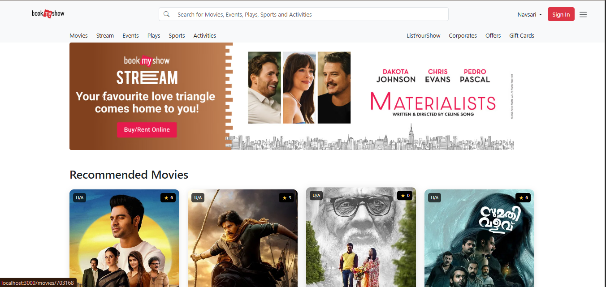

# BookMyShow Clone (Node.js)

A full-stack web application that replicates the core features of BookMyShow, allowing users to browse movies, view details, book tickets, and manage their bookings. Built using Node.js, Express, MongoDB, and EJS templating.

# Deployment Link here :
 
https://pr-bookmyshow-clone-node-js.onrender.com/
---
# Output



## 🚀 Features

- **User Authentication**: Sign up, login, and session management.
- **Movie Listings**: Browse movies fetched from TMDB API.
- **Movie Details**: View detailed information about each movie.
- **Showtimes & Booking**: Select showtimes and book tickets.
- **Booking Management**: View and manage your bookings.
- **Responsive UI**: Clean, modern interface with EJS and custom CSS.

---

## 🛠️ Technologies Used

- **Backend**: Node.js, Express.js
- **Database**: MongoDB (Mongoose ODM)
- **Authentication**: Sessions, bcrypt
- **Templating**: EJS
- **API Integration**: TMDB (The Movie Database)
- **Frontend**: HTML, CSS (custom), EJS

---

## 📁 Folder Structure

```
├── index.js                # Entry point
├── package.json            # Project metadata & dependencies
├── assets/                 # Static files (CSS, images)
│   ├── css/
│   └── images/
├── configs/
│   └── db.js               # MongoDB connection
├── controllers/            # Route logic
│   ├── authcontroller.js
│   ├── bookingController.js
│   ├── homeController.js
│   ├── movieController.js
│   ├── showController.js
│   └── userController.js
├── models/                 # Mongoose schemas
│   ├── bookingSchema.js
│   ├── movieSchema.js
│   ├── showSchema.js
│   └── userSchema.js
├── routers/                # Express routers
│   ├── authRouter.js
│   ├── bookingRouter.js
│   ├── homeRouter.js
│   ├── index.js
│   ├── movieRouter.js
│   ├── showRouter.js
│   └── userRouter.js
├── services/
│   └── tmdb.js             # TMDB API integration
├── views/                  # EJS templates
│   ├── index.ejs
│   ├── pages/
│   │   ├── booking.ejs
│   │   └── movie.ejs
│   └── partials/
│       ├── authModal.ejs
│       ├── footer.ejs
│       └── header.ejs
```

---

## ⚙️ How It Works

1. **Startup**: Run `npm install` to install dependencies, then `node index.js` to start the server.
2. **Database**: Connects to MongoDB using Mongoose (see `configs/db.js`).
3. **Routing**: All routes are defined in the `routers/` folder and handled by corresponding controllers.
4. **Authentication**: Users can register and login. Sessions are managed for authentication.
5. **Movies**: Movie data is fetched from the TMDB API (`services/tmdb.js`) and displayed on the homepage.
6. **Booking**: Users can select a movie, choose a showtime, and book tickets. Bookings are stored in MongoDB.
7. **Views**: All pages are rendered using EJS templates in the `views/` folder.
8. **Static Assets**: CSS and images are served from the `assets/` directory.

---

## 📝 Setup & Usage

1. **Clone the repository**
   ```sh
   git clone <https://github.com/Soaib-Shaikh/PR-BookMyShow-Clone-Node.js.git>
   cd PR-BookMyShow-Clone-Node.js
   ```
2. **Install dependencies**
   ```sh
   npm install
   ```
3. **Configure Environment**
   - Set up your MongoDB URI in `configs/db.js`.
   - Add your TMDB API key in `services/tmdb.js`.
4. **Run the app**
   ```sh
   node index.js
   ```
5. **Visit**
   - Open [http://localhost:3000](http://localhost:3000) in your browser.

---

## 📌 Notes
- Make sure MongoDB is running locally or provide a remote URI.
- TMDB API key is required for fetching movie data.
- For production, use environment variables for sensitive data.

---

## 🙏 Credits
- [TMDB API](https://www.themoviedb.org/documentation/api)
- Inspired by BookMyShow

---

## 📃 License
This project is for educational purposes only.
